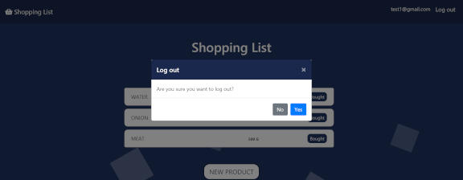

# SHOPPING LIST
> Hi everyone! This is my version of Shopping List App. 

## Live
https://mateuszlubianka1993.github.io/shopping-list-js-v2/

## Technologies:
* Java Script
* HTML5
* CSS 3
* Bootstrap
* Firebase

## General info
I made this app to learn how to use Firebase auth and database. 
This is simple shopping list. You can sign up, log in and add items to the list. You can also delete item from the list.

## Screenshots

## Contact
Created by [lubiankamateusz@gmail.com] - feel free to contact me!